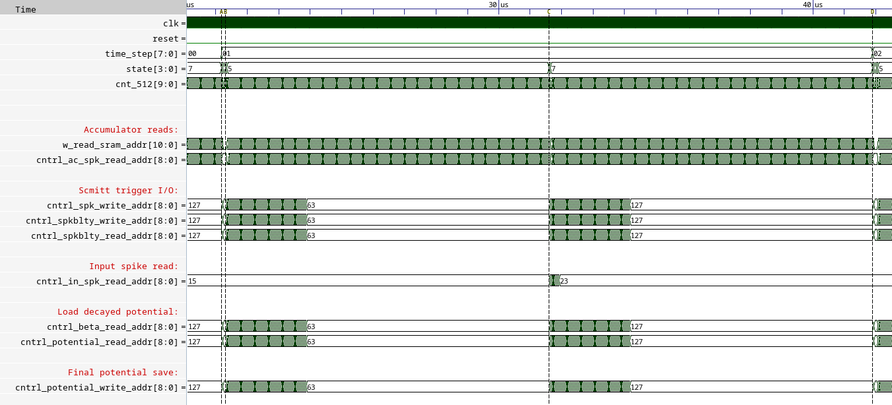

# OpenSpike
OpenSpike a spiking neural network (SNN) accelerator made using fully open-source EDA tools, process design kit (PDK), and memory macros synthesized using [OpenRAM](https://openram.org/). The chip is taped out in the 130 nm SkyWater process and integrates over 1 million synaptic weights, and offers a reprogrammable architecture. It operates at a clock speed of 40 MHz, a supply of 1.8 V, uses a PicoRV32 core for control, and occupies an area of 33.3 mm<sup>2</sup>. The throughput of the accelerator is 48,262 images per second with a wallclock time of 20.72 μs, at 56.8 GOPS/W. The spiking neurons use hysteresis to provide an adaptive threshold (i.e., a Schmitt trigger) which can reduce state instability. This results in high performing SNNs across a range of benchmarks that remain competitive with state-of-the- art, full precision SNNs.


<p align="center" float="center">
  
</p>

## Citation
If you find OpenSpike useful in your work, please cite the following source:

```
@inproceedings{modaresi2023openspike,
  title        = {OpenSpike: An OpenRAM SNN Accelerator}
  author       = {Modaresi, Farhad and Guthaus, Matthew and Eshraghian, Jason K},
  booktitle    = {2023 IEEE International Symposium on Circuits and Systems (ISCAS)},
  year         = {2023},
  organization = {IEEE}
}
```

## Timing
<p align="center" float="center">
  
</p>


